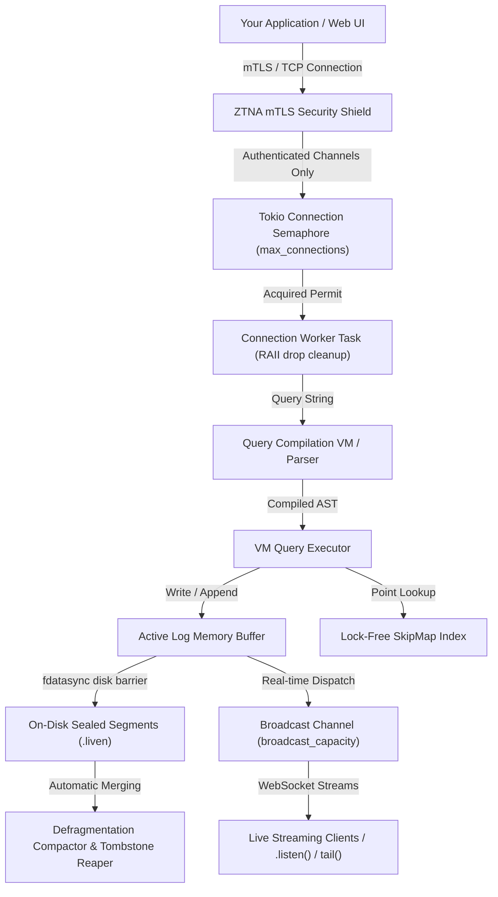

# LIVEN ⚡

LIVEN is a high-performance, lightweight stream database and vector similarity engine engineered to capture, store, secure, and stream high-velocity data in real time. It is designed to handle continuous streams of information—such as AI agent reasoning, real-time prediction markets, IoT telemetry, and live sports analytics—while maintaining deterministic safety limits, Zero-Trust security shields, and sub-microsecond query performance.

---

## Technical Architecture & Design System

The core LIVEN engine is designed from the ground up for predictable resource allocation, cryptographic safety, and lock-free execution speeds. Below is the end-to-end design system of how data flows safely into the engine:



---

## Premium System Capabilities

### 🛡️ Zero-Trust Network Architecture (ZTNA) & mTLS Shield
LIVEN features a single-port secure network implementation. It automatically wraps all transport boundaries in mutual TLS (mTLS) with custom CA validation chains:
* **Production Mode**: Enforces strict client certificate validation, immediately dropping unauthenticated, cleartext, or invalid handshakes at the TCP boundary.
* **Granular ACL Verification**: Employs client Common Name (CN) filtering to map incoming connection keys to specific stream scopes, securing multi-tenant operations.

### 🚦 Bounded Client Concurrency (Connection Bounding)
To prevent server starvation, connection boundaries are actively controlled by a central `tokio::sync::Semaphore` permit coordinator:
* **Permit-Limit**: Instantiated using the configured `max_connections` limit.
* **RAII Drop Lifecycle**: Acquires an owned permit before spawning connection worker loops. Upon connection closing, standard RAII drop instantly releases the permit, establishing a strict upper bound on thread and connection footprint.

### 🧬 Real-Time Stream Tailing & Listening
Clients can subscribe to instant write feeds using the built-in streaming query VM stages:
* **`.listen()` and `tail()`**: Subscriptions tap directly into internal, highly-buffered broadcast channels (configured with `broadcast_capacity` to prevent memory leaks on slow readers).
* **Live Indicators**: The built-in Web Query Console features dynamic, pulsing emerald streaming badges (`TAILING LIVE STREAM`), inline streaming telemetry feeds, and interactive STOP action controls.

### 📐 Quantized Vector Similarity Engine
LIVEN incorporates deep vector processing pipelines directly inside its storage engine:
* **Binary Quantization Codec**: Compresses high-dimensional vectors into spatial bit arrays, reducing memory footprints.
* **Cosine Similarity VM Steps**: Executes high-speed cosine similarity filters in compiled pipeline query loops, enabling ultra-fast spatial search capabilities directly on historical logs.

### ⏱️ Deterministic Resource Budgeting
* **OOM Prevention (`max_index_ram_mb`):** Measures SkipMap pointer and key allocation sizes. Rejects writes transactionally with `"Index RAM limit exceeded"` if they violate the RAM ceiling while prioritizing delete/tombstone operations.
* **LRU File Cache (`max_open_file_descriptors`):** Evicts inactive segment file descriptors in real time to prevent the operating system from encountering `EMFILE` limits under high stream densities.

---

## Simple Configuration (`liven.toml`)

Configure network ports, secure boundaries, and strict resource budgets from a single configuration file:

```toml
[server]
environment = "development"
host = "127.0.0.1"
db_port = 43121             # Native binary wire port
webui_port = 43120          # Web Query Console port
max_connections = 10000     # Strict Semaphore concurrency boundary
broadcast_capacity = 4096   # Memory buffer ceiling for streaming queries

[storage]
data_directory = "./data"   # Safe permanent storage folder

[limits]
max_concurrent_streams = 32      # Maximum unique streams allowed
max_open_file_descriptors = 64   # Strict ceiling on cached file handles
max_index_ram_mb = 16            # Limit on SkipMap in-memory index footprint
max_segment_size_mb = 16         # Active log segment roll threshold
```

---

## Performance & Ingestion Benchmarks

Criterion-powered micro-benchmarks profiles LIVEN under tight, single-threaded resource budgets:

* **Query Compilation Speed**: ~291 ns for simple parsing stages; ~697 ns for complex, multi-stage pipelines.
* **Lock-Free Point-Lookups**: ~1.35 µs for key hits; sub-100 ns (~99 ns) to instantly prune non-existent keys.
* **Strict Durability Ingestion**: ~238 writes/second with individual hardware `fdatasync` disk-sync barriers active, rising to thousands of batch writes/second in memory-buffered writes.
* **Baseline Footprint**: ~12MB lightweight operational memory baseline on boot.

---

## Quick Start

### 1. Launch LIVEN Server
```bash
# Compile and boot LIVEN server using liven.toml
cargo build --release
cargo run --bin liven -- start --config liven.toml
```

### 2. Launch the Web Query Console
```bash
cd ui
npm install
npm run dev
```

### 3. Run Verification Suite & Benchmarks
```bash
# Run all tests (unit, integration, ZTNA, parser, and storage compaction)
cargo test

# Run micro-benchmarks
cargo bench
```

---

## Contributors

* **Olalekan** — Lead Developer & Architect
* **LIVEN Contributors** — Open-source community creators
