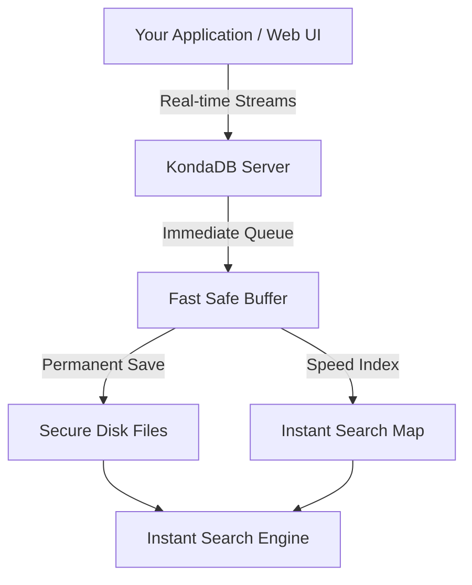

# KondaDB ⚡

KondaDB is a fast, lightweight database built to capture, store, and stream data in real time. It is designed to handle continuous streams of information—like AI tracking, live sports activities, financial market updates, or device logs—and make that data instantly searchable.

---

## What It Does

*   **Instant Data Ingestion:** Safely records massive streams of incoming data without slowing down or creating bottlenecks.
*   **Crash-Proof Safety:** Writes data down securely the exact millisecond it happens, ensuring no information is lost or corrupted if the system goes down.
*   **Lightning-Fast Lookups:** Finds and retrieves any specific piece of historical data completely instantly.
*   **Automatic Cleanup:** Runs quiet background cleanups to compress files and clear out old deleted data, keeping your storage clean and efficient.
*   **Two Visual Dashboards:**
    *   **Interactive Terminal View (TUI):** A built-in terminal dashboard for monitoring performance and data flows directly from your command line.
    *   **Modern Web Dashboard:** A beautiful, real-time web interface to browse your data streams, run search queries, and view records in clean list or table layouts.

---

## How It Works Under the Hood

When data flows into KondaDB, it moves through a streamlined, highly secure pipeline:



---

## Getting Started

### Prerequisites

Make sure you have **Rust** (Rust 2024 edition) and **Node.js** installed on your computer.

### 1. Run the Database Server

```bash
# Build the database program
cargo build --release

# Start the KondaDB server
cargo run --bin kondadb
```

### 2. Launch the Web Dashboard

```bash
# Move into the user interface folder
cd ui

# Install layout dependencies
npm install

# Start the live web interface
npm run dev
```

---

## Running Tests & Benchmarks (Dev Mode)

To run the robust test suite or profile the engine's performance bounds during development:

```bash
# Run all unit, integration, and syntax tests
cargo test

# Run Criterion-powered micro-benchmarks (profiles ingestion / search loops)
cargo bench
```

---

## Simple Configuration (`kondadb.toml`)

You can easily manage your network ports, storage folders, and strict runtime limits from a single configuration file:

```toml
[server]
environment = "development"
host = "127.0.0.1"
db_port = 43121      # Port for your data streams
webui_port = 43120   # Port to open your web dashboard

[storage]
data_directory = "./data"   # Folder where files are stored safely

[limits]
max_concurrent_streams = 32      # Maximum unique streams allowed concurrently
max_open_file_descriptors = 64   # Strict ceiling on cached open file handles
max_index_ram_mb = 16            # Limit on SkipMap in-memory index footprint
max_segment_size_mb = 16         # Active log-file size threshold before rolling
```

---

## Deterministic Resource Budgeting & Safety Limits

KondaDB is engineered to run reliably under tight, predictable resource ceilings. Rather than letting resource consumption scale unchecked, the storage engine enforces strict bounds to prevent critical system failures:

*   **OOM Prevention (`max_index_ram_mb`):** KondaDB dynamically profiles in-memory index footprint by measuring pointer and structure overhead (`compound_key.len() + 64` bytes). Writes are pre-validated transactionally on the caller thread and rejected with `"Index RAM limit exceeded"` if they violate this budget. Delete/tombstone operations are always allowed, permitting immediate memory reclamation.
*   **EMFILE (File Descriptor) Prevention (`max_open_file_descriptors`):** Dynamic LRU-style pruning of the file handle cache ensures the database never exceeds its file descriptor allocation limit. Inactive read-only segment file handles are evicted and automatically closed by the operating system once any active reader drops their reference, completely mitigating resource exhaustion.
*   **Stream Ceilings (`max_concurrent_streams`):** Keeps stream ingestion bounded, preventing indexing and descriptor counts from scaling uncontrollably. Stream boundaries are checked sequentially on recovery (halting bad engines fast) and transactionally on write paths.
*   **Segment Size Limits (`max_segment_size_mb`):** Sets a clear boundary on the active log-file size, ensuring rapid rolling, efficient compaction, and predictable chunking.

---

## Current KondaDB Stats & Performance

Our automated micro-benchmarks demonstrate the exact performance profile of the storage engine under tight execution limits:

* **Query Parsing Speed:** ~291 ns for simple filters; ~697 ns for complex, multi-stage telemetry pipelines.
* **Point-Lookup Latency:** ~1.35 µs for existing keys using lock-free index positional reads; sub-100 ns (~99 ns) to instantly prune non-existent keys.
* **Fully Safe Ingestion Rate:** ~119 batches/second (~238 writes/second) when running in strict durability mode (forces a physical `fdatasync` disk-sync barrier per batch of 2 records to ensure absolute crash resistance).
* **Storage Integrity:** Every structural frame is sealed with a custom CRC32 chunk hash, verified automatically on recovery.
* **Memory Footprint:** ~12MB lightweight operational baseline.

---

## Contributors

*   **Olalekan** — Lead Developer & Architect
*   **KondaDB Contributors** — Open-source community creators
