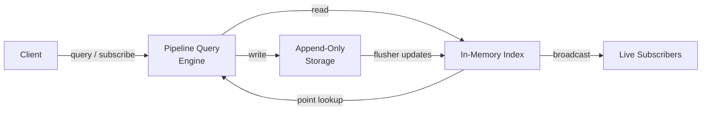

<p align="center">
  <picture>
    <source media="(prefers-color-scheme: dark)" srcset="./assets/logo.svg">
    
  </picture>
  <br/>
  <strong>LivenDB</strong>
</p>

<p align="center">
  <a href="https://github.com/livendb/liven/actions/workflows/build.yml">
    
  </a>
  <a href="https://github.com/livendb/liven/pkgs/container/liven">
    
  </a>
  <a href="https://crates.io/crates/liven">
    
  </a>
  <a href="https://crates.io/crates/liven">
    
  </a>
</p>

---

> **Stream. Process. Store. One Engine.**

Liven is a database built for data that moves. It ingests streaming data, transforms it on the fly, and stores it durably — all with a single pipeline query language. One binary.

```sh
# Install via crates.io
cargo install liven

# Launch the server
liven start

# One-liner install (Linux & macOS)
curl --proto '=https' --tlsv1.2 -sSf https://livendb.com/install | sh
```

---

## Why Liven?

Databases today make you choose: batch or stream? Historical or real-time? Key-value or vector? Liven was built to erase those lines.

**One query language, two modes:**
- Historical queries against stored data
- Real-time subscriptions on the same pipeline — just add `.listen()`

**One engine, three deployment models:**
- Embedded library (~1.5 MB) — runs inside your Rust process
- Network server — TCP + WebSocket, thousands of clients
- Interactive TUI or web dashboard — for ad-hoc queries and monitoring

**Built-in capabilities that usually require separate systems:**
- Vector similarity search (int8 quantized, cosine similarity)
- Stream joins (time-bounded correlate, multi-hop chain)
- Event pattern detection (sequence FSM)
- Time-windowed aggregations
- Full-text substring matching

---

## Quick Start

```bash
# Launch the server
cargo build --release
./target/release/liven start
# → Open http://localhost:43120
# → Admin auth key printed on first start — save it

# Insert and query
liven query 'from("events").insert("e1", {type: "click"})'
liven query 'from("events") | filter(type == "click") | count()'

# Live subscription
liven query 'from("events") | filter(priority == "high") .listen()'
```

### Embedded in Rust

```toml
[dependencies]
liven = { version = "0.0", default-features = false }
```

For a minimal embedded build with no server, TUI, or TLS:

```rust
use liven::Liven;

let db = Liven::open("./data")?;
db.query(r#"from("events").insert("e1", {type: "click"})"#)?;
let results = db.query(r#"from("events") | filter(type == "click")"#)?;
```

**[Full documentation &rarr;](https://docs.rs/liven)**

---

## How It Works (at a glance)



- **Writes** are appended to segment files. A background flusher batches them for throughput without sacrificing durability.
- **Reads** go through a lock-free in-memory index. Point lookups resolve in microseconds.
- **Subscriptions** broadcast every write to all listeners. The server evaluates pipeline filters before delivery.
- **Compaction** reclaims space from deleted records automatically.
- **Recovery** replays segments on startup. Checksums catch corruption.

---

## Installation

### From crates.io

```sh
cargo install liven
```

### From source

```sh
git clone https://github.com/livendb/liven
cd liven
cargo build --release
./target/release/liven start
```

> Before building with the `server` feature, build the Web UI first:
> ```bash
> cd ui && npm ci --legacy-peer-deps && npm run build && cd ..
> ```
> Or skip the dashboard entirely: `cargo build --no-default-features`


### Docker

```sh
docker run -p 43121:43121 -p 43120:43120 ghcr.io/livendb/liven
```

### Package managers

| Platform | Format | Command |
|----------|--------|---------|
| Debian/Ubuntu | `.deb` | `cargo deb --no-build -p liven` |
| Fedora/RHEL | `.rpm` | `cargo generate-rpm --no-build -p liven` |
| macOS | `.dmg` / `.tar.gz` | See [RELEASE.md](./RELEASE.md) |
| Windows | `.msi` / `.zip` | See [RELEASE.md](./RELEASE.md) |

Pre-built packages for each platform are available on the
[GitHub Releases](https://github.com/livendb/liven/releases) page.

---

## Logs

Liven logs to stdout/stderr. View logs based on your platform:

| Platform | Command |
|----------|---------|
| Linux (systemd) | `sudo journalctl -u liven -f` |
| Linux (manual) | `liven start > liven.log 2>&1` |
| macOS (launchd) | `tail -f /usr/local/var/log/liven/stdout.log` |
| macOS (manual) | `liven start > liven.log 2>&1` |
| Windows | `liven.exe start > liven.log 2>&1` |

**Advanced:** Set `RUST_LOG=debug` or `RUST_LOG=trace` for verbose output.

---

## Security

### Auth-key mode (default)

Symmetric keys with BLAKE3 hashing. Four role levels:

| Role | Read | Insert | Delete | Admin |
|------|------|--------|--------|-------|
| `read-only` | ✅ | ❌ | ❌ | ❌ |
| `write` | ✅ | ✅ | ❌ | ❌ |
| `write-delete` | ✅ | ✅ | ✅ | ❌ |
| `admin` | ✅ | ✅ | ✅ | ✅ |

Keys can be generated, revoked, and role-changed at runtime via the Web UI or REST API — no server restart required.

### mTLS / ZTNA

Mutual TLS with X.509 certificates. Client CN maps to capabilities. Single-port mode multiplexes cleartext and TLS on the same listener.

### Master key

Stored in `./liven.key` (mode 0600). Override with `LIVEN_SECURITY_MASTER_KEY` environment variable.

---

## Feature flags

Liven uses Cargo feature flags to control the binary size. The `default` feature includes everything:

| Feature |  Size impact |
|---------|-------------|-------------|
| `server` |  ~+3 MB (web UI + REST API) |
| `tui` |  ~+1 MB (interactive terminal) |
| `tls` |  ~+500 KB (mTLS support) |

```sh
# Minimal embedded build (no server, no TUI, no TLS)
cargo build --release --no-default-features

# Embedded with TLS support
cargo build --release --no-default-features --features tls
```

---

## Licensing

**SSPL 1.0 OR Commercial**

- **SSPL** — Free for self-hosting, development, and personal use.
- **Commercial** — Required for managed services or proprietary embedding.

Contact `team@livendb.com` for commercial licensing.

[**Full license &rarr;**](./LICENSE-SSPL)

## Contributing

Contributions are welcome! See [CONTRIBUTING.md](./CONTRIBUTING.md) for guidelines on submitting pull requests, code style, and development setup.

All contributors are expected to follow our [Code of Conduct](./CODE_OF_CONDUCT.md).
