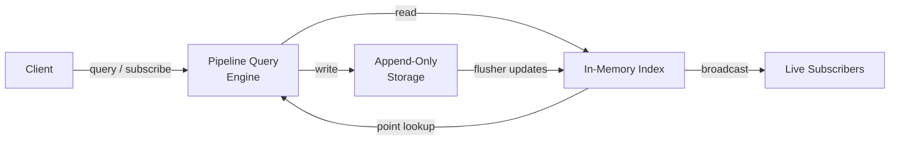

<p align="center">
  <picture>
    <source media="(prefers-color-scheme: dark)" srcset="./assets/logo.svg">
    
  </picture>
  <br/>
  <strong>LivenDB</strong>
</p>

<p align="center">
  <a href="https://github.com/livendb/liven/actions/workflows/build.yml">
    
  </a>
  <a href="https://github.com/livendb/liven/pkgs/container/liven">
    
  </a>
  <a href="https://crates.io/crates/liven">
    
  </a>
  <a href="https://crates.io/crates/liven">
    
  </a>
</p>

---

> **Stream. Process. Store. One Engine.**

Liven is a database built for data that moves. It ingests streaming data, transforms it on the fly, and stores it durably — all with a single pipeline query language. One binary.

```sh
# Install via crates.io
cargo install liven

# One-liner install (Linux & macOS)
curl --proto '=https' --tlsv1.2 -sSfL https://livendb.com/install | sh

# Install via Docker
docker pull ghcr.io/livendb/liven:latest
docker run -p 43121:43121 -p 43120:43120 -v ./data:/var/lib/liven livendb/liven:latest

# Launch the server
liven start
```

---

## Why Liven?

Databases today make you choose: batch or stream? Historical or real-time? Key-value or vector? Liven was built to erase those lines.

**One query language, two modes:**
- Historical queries against stored data
- Real-time subscriptions on the same pipeline — just add `.listen()`

**One engine, three deployment models:**
- Embedded library (~1.5 MB) — runs inside your Rust process
- Network server — TCP + WebSocket, thousands of clients
- Interactive TUI or web dashboard — for ad-hoc queries and monitoring

**Built-in capabilities that usually require separate systems:**
- Vector similarity search (int8 quantized, cosine similarity)
- Stream joins (time-bounded correlate, multi-hop chain)
- Event pattern detection (sequence FSM)
- Time-windowed aggregations
- Full-text substring matching

---

## Quick Start

```bash
# Launch the server
cargo build --release
./target/release/liven start
# → Open http://localhost:43120
# → Admin auth key printed on first start — save it

# Insert and query
liven query 'from("events").insert("e1", {type: "click"})'
liven query 'from("events") | filter(type == "click") | count()'

# Live subscription
liven query 'from("events") | filter(priority == "high") .listen()'
```

### Embedded in Rust

Add the dependency with the features you need:

```toml
[dependencies]
liven = "0.0.3"
```

For a minimal embedded build with no server, TUI, or TLS:

```toml
[dependencies]
liven = { version = "0.0.3", default-features = false }
```

---

## Rust Crate API

Liven provides two usage modes via the same unified method signatures:

| Mode | Initialization | Runtime |
|------|---------------|---------|
| **Embedded** | `Liven::open("./data")?` | In-process, no server needed |
| **Wire** | `LivenClient::connect("127.0.0.1:43121").await?` | Remote server over TCP |

Both modes expose the same methods (`insert`, `get`, `filter`, `enrich`, etc.) —
the embedded versions are synchronous, the wire versions are async.

```rust
use liven::Liven;
use liven::client::LivenClient;
use liven::query::{Pipeline, Filter};
use serde_json::json;

// ── Embedded ──
let db = Liven::open("./data")?;
db.insert("events", "e1", json!({"type": "click"}))?;
let results = db.run(
    Pipeline::from("events")
        .filter(Filter::field("type").eq("click"))
        .limit(10)
)?;

// ── Wire (async) ──
let mut client = LivenClient::connect("127.0.0.1:43121").await?;
client.insert("events", "e1", json!({"type": "click"})).await?;
let results = client.run(
    &Pipeline::from("events")
        .filter(Filter::field("type").eq("click"))
        .limit(10)
        .build(),
).await?;
```

> **Tip:** Use `db.query("...")` for ad-hoc string queries and `db.insert(...)` / `db.get(...)` etc.
> for the typed API. Both work identically in embedded mode and over the wire.

### Connection URL

The wire client supports connection URLs with optional auth key:

```rust
// Plain TCP
LivenClient::connect("127.0.0.1:43121").await?;

// With auth key in URL
LivenClient::connect("127.0.0.1:43121?auth_key=my_secret").await?;
```

### CRUD operations

```rust
// ── Embedded ──        // ── Wire (async) ──
db.insert("users", "u1", json!({"name":"Alice"}))?;
                        // client.insert("users", "u1", json!(...)).await?;

db.upsert("users", "u1", json!({"name":"Alice"}))?;
db.update("users", "u1", json!({"status":"active"}))?;
db.get("users", "u1")?;
db.delete("users", "u1")?;
db.clear("logs")?;
db.drop_stream("temp")?;
db.insert_many("orders", vec![("o1".into(), json!({"amount":100}))])?;
db.upsert_many("orders", vec![("o1".into(), json!({"amount":200}))])?;

// Metadata
db.streams()?;
db.status()?;
```

### Pipeline operations

```rust
use liven::query::{Pipeline, Filter};
use liven::types::AggregateStrategy;

// ── Embedded ──                    // ── Wire (async) ──
db.filter("events",                   // client.filter("events",
    Filter::field("type").eq("click"), //   Filter::field("type").eq("click"),
)?;                                     // ).await?;

db.limit("events", 10)?;             // client.limit("events", 10).await?;
db.count("events")?;                  // client.count("events").await?;
db.sort("events", "timestamp", true)?; // client.sort("events","timestamp",true).await?;
db.page("events", 1, 50)?;           // client.page("events", 1, 50).await?;
db.map("users", vec!["name".into(), "email".into()])?;
db.window("metrics", 60_000, AggregateStrategy::avg())?;
db.group("events", "type", vec!["count".into()])?;
db.distinct("users", "email")?;
db.page_cursor("events", "cursor_abc", 50)?;

// Vector similarity
db.vector_filter("embeddings", "vector", vec![12, -5, 3], 0.85)?;

// Stream joins
db.enrich("logs", "users", "user_id")?;
db.correlate("events", "orders", "user_id", 5000)?;
db.chain("prompts", "responses", "prompt_id")?;
db.sequence("system_events",
    vec![Filter::field("event").eq("disk_full"),
         Filter::field("event").eq("crash")],
    10_000)?;
```

### Pipeline builder (for complex chains)

When you need multiple stages, use the builder and execute with `db.run()`:

```rust
use liven::query::{Pipeline, Filter};

let pipeline = Pipeline::from("orders")
    .filter(Filter::field("amount").gte(100.0))
    .filter(Filter::field("status").eq("completed"))
    .sort("amount", true)
    .limit(10);

// Embedded
db.run(pipeline.clone())?;

// Wire
client.run(&pipeline.build()).await?;
```

### Pipeline update / delete

```rust
let pipeline = Pipeline::from("orders")
    .filter(Filter::field("status").eq("pending"));

// Update all matching records
db.pipeline_update(pipeline.clone(), json!({"status": "cancelled"}))?;

// Delete all matching records
db.pipeline_delete(pipeline)?;
```

### Explain

```rust
use liven::query::Query as Q;

let plan = db.explain(Q::insert("events", "e1", json!({"x": 1})))?;
```

### Real-time subscriptions

```rust
use liven::query::{Pipeline, Filter};

// Blocking subscription (embedded, non-async)
loop {
    if let Some(record) = db.subscribe_sync(std::time::Duration::from_millis(100))? {
        println!("New: {}", record.key);
    }
}

// Async subscription (embedded)
let mut rx = db.subscribe();
tokio::spawn(async move {
    while let Ok(record) = rx.recv().await {
        println!("Live: {:?}", record);
    }
});

// Wire streaming (client)
use futures_util::StreamExt;
let mut stream = client.listen("events").await?;
while let Some(Ok(record)) = stream.next().await {
    println!("Got: {}", record.key);
}
```

### Custom configuration

```rust
use liven::embed::{LivenConfig, Liven};

let config = LivenConfig {
    max_streams: 128,
    max_index_ram_mb: 1024,
    ..Default::default()
};
let db = Liven::open_with_config("./data", config)?;
```

### Full example

```rust
use liven::Liven;
use liven::query::{Pipeline, Filter};
use serde_json::json;

fn main() -> Result<(), Box<dyn std::error::Error>> {
    let dir = format!("./liven_demo_{}", std::process::id());
    let db = Liven::open(&dir)?;

    // Insert
    db.insert("events", "e1", json!({"type": "click", "value": 10}))?;
    db.insert("events", "e2", json!({"type": "purchase", "value": 50}))?;
    db.insert("events", "e3", json!({"type": "click", "value": 20}))?;

    // Query
    let clicks = db.filter("events", Filter::field("type").eq("click"))?;
    println!("Clicks: {:?}", clicks);

    // Count
    let count = db.count("events")?;
    println!("Total: {:?}", count);

    let _ = std::fs::remove_dir_all(&dir);
    Ok(())
}
```

**[Full API documentation &rarr;](https://docs.rs/liven)**

---

## How It Works (at a glance)



- **Writes** are appended to segment files. A background flusher batches them for throughput without sacrificing durability.
- **Reads** go through a lock-free in-memory index. Point lookups resolve in microseconds.
- **Subscriptions** broadcast every write to all listeners. The server evaluates pipeline filters before delivery.
- **Compaction** reclaims space from deleted records automatically.
- **Recovery** replays segments on startup. Checksums catch corruption.

---

## Installation

### From crates.io

```sh
cargo install liven
```

### From source

```sh
git clone https://github.com/livendb/liven
cd liven
cargo build --release
./target/release/liven start
```

> Before building with the `server` feature, build the Web UI first:
> ```bash
> cd ui && npm ci --legacy-peer-deps && npm run build && cd ..
> ```
> Or skip the dashboard entirely: `cargo build --no-default-features`


### Docker

```sh
docker run -p 43121:43121 -p 43120:43120 ghcr.io/livendb/liven
```

### Package managers

| Platform | Format | Command |
|----------|--------|---------|
| Debian/Ubuntu | `.deb` | `cargo deb --no-build -p liven` |
| Fedora/RHEL | `.rpm` | `cargo generate-rpm --no-build -p liven` |
| macOS | `.dmg` / `.tar.gz` | See [RELEASE.md](./RELEASE.md) |
| Windows | `.msi` / `.zip` | See [RELEASE.md](./RELEASE.md) |

Pre-built packages for each platform are available on the
[GitHub Releases](https://github.com/livendb/liven/releases) page.

---

## Logs

Liven logs to stdout/stderr. View logs based on your platform:

| Platform | Command |
|----------|---------|
| Linux (systemd) | `sudo journalctl -u liven -f` |
| Linux (manual) | `liven start > liven.log 2>&1` |
| macOS (launchd) | `tail -f /usr/local/var/log/liven/stdout.log` |
| macOS (manual) | `liven start > liven.log 2>&1` |
| Windows | `liven.exe start > liven.log 2>&1` |

**Advanced:** Set `RUST_LOG=debug` or `RUST_LOG=trace` for verbose output.

---

## Security

### Auth-key mode (default)

Symmetric keys with BLAKE3 hashing. Four role levels:

| Role | Read | Insert | Delete | Admin |
|------|------|--------|--------|-------|
| `read-only` | ✅ | ❌ | ❌ | ❌ |
| `write` | ✅ | ✅ | ❌ | ❌ |
| `write-delete` | ✅ | ✅ | ✅ | ❌ |
| `admin` | ✅ | ✅ | ✅ | ✅ |

Keys can be generated, revoked, and role-changed at runtime via the Web UI or REST API — no server restart required.

### mTLS / ZTNA

Mutual TLS with X.509 certificates. Client CN maps to capabilities. Single-port mode multiplexes cleartext and TLS on the same listener.

### Master key

Stored in `./liven.key` (mode 0600). Override with `LIVEN_SECURITY_MASTER_KEY` environment variable.

---

## Feature flags

Liven uses Cargo feature flags for modular builds.

The `default` feature enables everything by pulling in `full`, which bundles all three optional capabilities.

| Feature  | What's included                                 |
|----------|-------------------------------------------------|
| `full`   | All features below (enabled by default)          |
| `server` | REST API + WebSocket + embedded Web UI           |
| `tui`    | Interactive terminal dashboard                   |
| `tls`    | mTLS support with X.509 certificates             |

```sh
# Minimal embedded build (no server, no TUI, no TLS)
cargo build --release --no-default-features

# Embedded with TLS support
cargo build --release --no-default-features --features tls
```

---

## Licensing

**SSPL 1.0 OR Commercial**

- **SSPL** — Free for self-hosting, development, and personal use.
- **Commercial** — Required for managed services or proprietary embedding.

Contact `team@livendb.com` for commercial licensing.

[**Full license &rarr;**](./LICENSE-SSPL)

## Contributing

Contributions are welcome! See [CONTRIBUTING.md](./CONTRIBUTING.md) for guidelines on submitting pull requests, code style, and development setup.

All contributors are expected to follow our [Code of Conduct](./CODE_OF_CONDUCT.md).
